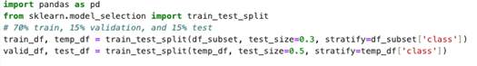

# University of Surrey - Applied Machine Learning Group Project 🦌

# Military Aircraft Detection

The identification and detection of military aircraft is a crucial task across diverse fields, including aviation safety, border security, and aerial surveillance. As strategic decisions heavily rely on accurate aircraft identification, this challenge requires advanced technological solutions. This repository presents a novel approach utilizing the YOLOv8 framework, a state-of-the-art object detection model, to address these challenges effectively. By exploiting YOLOv8's sophisticated architecture, applying surgical transfer learning techniques, data augmentation to balance the training dataset, and an optional VariFocal Loss function, our model successfully identifies aircraft across multiple scales and wide-ranging backgrounds. The system generates precise bounding boxes and class labels, providing essential information for both aircraft identification and spatial localization. 

## Directory Layout
```bash
project_name
├── LICENSE
├── README.md
├── code
├── notebooks
├── runs
├── .env
├── .gitignore
├── args.py
├── main.py
├── requirements.txt
├── train.sh
└── utils.py
```

## Code Setup

There are two options for setting up the code environment. 

* A `code` directory with a `poetry` setup with the necessary dependencies.

To install the dependencies, run the following commands in the code directory:
```bash
poetry shell
poetry install
```

For information on installing and getting started with poetry see https://python-poetry.org/docs/

* A `requirements.txt` can be used to run notebooks in either a jupyter or colab environment. 

```bash
pip install -r requirements.txt
```

## Data Processing

The dataset used in this project is the Military Aircraft Detection dataset freely available on Kaggle. https://www.kaggle.com/datasets/a2015003713/militaryaircraftdetectiondataset/data

This dataset is designed for object detection of military aircraft and encompasses 81 different military aircraft types. Some types are merged as one class along with their variants because their airframes or external features differ only slightly, making them difficult to distinguish—especially when only parts of the aircraft are visible.

The original dataset consists of approximately 19,500 high-resolution images, totaling over 10 GB in size, which is not optimal for systems with limited computational resources. 

The `datset_processing.ipynb` notebook found in path `notebooks\dataset_processing.ipynb` can be used to address this problem, as well as, perform initial data exploration. 

The following preprocessing steps may be applied using `dataset_processing.ipynb`: 
•	All images resized to 640×640 pixels, aligning with YOLO's input dimensions. This ensures that no further resizing us needed within the YOLO pipeline, reducing preprocessing overhead. 
•	Select 50% of the dataset for the experiments (although the pipeline supports any user-defined split ratio). Using `train_test_split()` from scikit-learn with the stratify parameter, class distribution was preserved after the split. This process results in a training set containing around 6,000 images, each resized to 640×640.


## Data Augmentation using Albumentations (augment_aml.py)
We used Albumentations(https://albumentations.ai/) to perform various augmentations. The following are the default settings. We implemented a logic to augment the underrepresented class to approximately match the highest represented class. In our experiment, the max count was around 600 and therefore we tried to match other classes with the augmentation. The code balances the underrepresented class but it scales the total dataset by lot. Therefore for the current implementation, we have hardcoded using the parameter max count in the code (augment_aml.py)
```
def get_augmentation_pipeline():
    return A.Compose([
        A.RandomSizedBBoxSafeCrop(height=640, width=640, erosion_rate=0.2, p=0.3),
        A.HorizontalFlip(p=0.5),
        A.VerticalFlip(p=0.2),
        A.RandomBrightnessContrast(p=0.4),
        A.Rotate(limit=15, p=0.3),
        A.Blur(blur_limit=3, p=0.2),
        A.ToGray(p=0.1),
        A.ShiftScaleRotate(shift_limit=0.05, scale_limit=0.05, rotate_limit=10, p=0.5),
    ], bbox_params=A.BboxParams(
        format='yolo',  
        label_fields=['class_labels'],
        min_visibility=0.1,
        clip=True
    ))
```
## Custom loss function using Varifocal Loss

We have reused the Varifocal class in the YOLO implementation and replaced the  default Binary cross-entropy loss. We have also modified the original Varifocal loss class for better numerical stability. We are summing the entire BCE result instead of calculating the mean first and then sum. We have also scalled the function with the sum of target scores after the loss calculations. All the implementation has been tested in an online intrerprter to build the function using outputs from the model. A snapshot of the smae will in the apendix section.

To run the custom loss function, you can directly replace the loss.py with the original loss.py, but we also created a custom class to make it easy for users to control the implementation using the main.py file.

### Logic implemented in Varifocal loss
```
import torch
import torch.nn as nn
import torch.nn.functional as F

def varifocal(pred_score, gt_score, label, alpha=1.0, gamma=2.0):
    weight = (alpha * pred_score.sigmoid().pow(gamma) * (1 - label) + gt_score * label)

    loss = (
        F.binary_cross_entropy_with_logits(pred_score.float(), gt_score.float(), reduction="none") * weight
    ).sum()

    return loss
                            
pred = torch.tensor([
    [-12.0588, -11.5061, -11.7534, -11.4176, -11.5307],
    [-11.7878, -11.3635, -11.9563, -11.1273, -11.3656],
    [-11.5275, -11.4884, -11.5407, -11.4327, -11.3850],
    [-11.4902, -11.5495, -11.5960, -11.7033, -11.5917],
    [-11.6447, -11.5400, -12.0725, -11.8199, -11.5589]
])
        
label = torch.tensor([
    [0, 1, 0, 0, 0],
    [0, 1, 0, 0, 0],
    [0, 1, 0, 0, 0],
    [0, 1, 0, 0, 0],
    [0, 1, 0, 0, 0]
])

gt_score = torch.tensor([
    [0.3243, 0.3354, 0.1903, 0.1454, 0.0575],
    [0.0378, 0.0497, 0.0415, 0.2735, 0.3274],
    [0.5033, 0.3340, 0.1531, 0.8357, 0.7885],
    [0.8577, 0.2637, 0.1733, 0.2391, 0.4647],
    [0.2409, 0.4048, 0.2963, 0.1799, 0.1501]
])

target_labels_one=torch.zeros(label.shape[0],label.shape[1],5) ------------>(1 hot encoding)
print(target_labels_one)
#torch.unsqueeze(target_labels_one,1)
#print(target_labels_one)
target_labels_one.scatter_(2, label.unsqueeze(-1).long(), 1) ----------> (match shape of the target label)
#print(target_labels_one)
target_scores_sum = max(target_scores.sum(), 1)
bce = nn.BCEWithLogitsLoss(reduction="none")
dtype = pred.dtype
loss = varifocal(pred,gt_score ,label)
#loss = bce(pred,gt_score.to(dtype)).sum()/target_scores_sum  # BCE
print("Loss:",loss)

```
### Changes in main.py for Varifocal loss

```
From ultralytics.utils.custom_detection_loss import CustomDetectionLoss 


def train(model=str, dataset_path=None, epochs=10, imgsz=640, hyp=None):
    data_yaml_files = glob.glob(os.path.join(dataset_path, '*.yaml'))
    if not data_yaml_files:
      raise FileNotFoundError(f"No YAML files found in {dataset_path}")
    yaml_file_path = data_yaml_files[0]
    print(hyp)
    print(f"Using YAML file: {yaml_file_path}")
    #custom_loss = CustomDetectionLoss(model.model) -----> uncomment for Varifocal loss
    #model.model.criterion = custom_loss -----> uncomment for Varifocal loss
    print("\nVerifying loss function:")
    print(f"Current criterion type: {type(model.model.criterion).__name__}")
    #assert isinstance(model.model.criterion, CustomDetectionLoss), "Custom loss not properly set!"
    print("Custom loss function successfully integrated!")
```

## Training

For training a model, there are a few options depending on where you have GPU access:

### Colab Workflow

* Training YOLOv5

    * Use the notebook located at path `notebooks\colab_workflow_yolov5_train_job.ipynb`. 
    This notebook uses the YOLOv5 🚀 github repo by Ultralytics to run a training job on [the latest yolov5 release, version 7.0](https://github.com/ultralytics/yolov5/releases).

* Training YOLOv8

    * To use a Colab or Jupyter Notebook to run the aml-group-project `main.py` file.
        Run the notebook located at path `notebooks\colab_workflow_yolov8_ultralytics.ipynb`

    * To run `main.py` directly
        - Adjust arguments in `train.sh`
        - Run 
        ```
        !/bin/bash train.sh
        ```

    * If you want to use Colab GPUs and modify the ultralytics code before attempting a training run. For instance, if you want to implement the custom VariFocal Loss. Then you will need to use the notebook located at `notebooks\colab_workflow_yolov8_ultralytics.ipynb`. 
        This notebook will clone the ultralytics/ultralytics repository allowing you to make changes to underlying code. 

## Validation

Validation can be performed in any of the training notebooks by running the following:

```
model = YOLO("path/to/best.pt")  # load a custom model

# Validate the model
metrics = model.val()  # no arguments needed, dataset and settings remembered
metrics.box.map  # map50-95
metrics.box.map50  # map50
metrics.box.map75  # map75
metrics.box.maps  # a list contains map50-95 of each category
```

Alternatively, run the main.py file directly with a saved custom model. 

1. Confirm the model path for the trained YOLO model. This should be in `runs\detect\train`
2. Confirm path to dataset for validation.
3. Adjust arguments in `valid.sh`
4. Run
        ```
        !/bin/bash valid.sh
        ```

## Inference

Inference or prediction can be performed in any of the training notebooks by running the following:

```
model = YOLO("path/to/best.pt")  # load a custom model

# Run batched inference on a list of images
results = model(["image1.jpg", "image2.jpg"])  # return a list of Results objects
```
Or to process results in a list:

```
# Process results list
for result in results:
    boxes = result.boxes  # Boxes object for bounding box outputs
    masks = result.masks  # Masks object for segmentation masks outputs
    keypoints = result.keypoints  # Keypoints object for pose outputs
    probs = result.probs  # Probs object for classification outputs
    obb = result.obb  # Oriented boxes object for OBB outputs
    result.show()  # display to screen
    result.save(filename="result.jpg")  # save to disk
```

1. Confirm the model path for the trained YOLO model. This should be in `runs\detect\train`
2. Confirm path to image on which to run inference.
3. Adjust arguments in `predict.sh`
4. Run
        ```
        !/bin/bash predict.sh
        ```

## Training RT-DETR

Training RT-DETR requires a slightly different workflow. `main.py` is not set up to run RT-DETR, so training, validation and inference should be completed in the notebook at this path `notebooks\RT-DETR_baseline.ipynb`.

```
from ultralytics import RTDETR

# Load a pretrained YOLO8l model
model = RTDETR("rtdetr-l.pt")

train_results = model.train(
    data="/content/ultralytics/datasets/data.yaml",
    task='detect', # Explicitly name task for the model.
    epochs=60,  # Number of training epochs
    imgsz=640,  # Image size for training
    warmup_epochs=0,  # Number of warmup epochs,
    project="aml_group_project",  # Directory to save training results
    name="rt-detr baseline",  # Name of the experiment
)
```

## Citations

YOLOv5 [](https://zenodo.org/records/7347926)

YOLOv8 - DOI pending
```
@software{yolov8_ultralytics,
  author = {Glenn Jocher and Ayush Chaurasia and Jing Qiu},
  title = {Ultralytics YOLOv8},
  version = {8.0.0},
  year = {2023},
  url = {https://github.com/ultralytics/ultralytics},
  orcid = {0000-0001-5950-6979, 0000-0002-7603-6750, 0000-0003-3783-7069},
  license = {AGPL-3.0}
}
```

RT-DETR [](https://doi.org/10.48550/arXiv.2304.08069)
```
    @misc{lv2023detrs,
        title={DETRs Beat YOLOs on Real-time Object Detection},
        author={Wenyu Lv and Shangliang Xu and Yian Zhao and Guanzhong Wang and Jinman Wei and Cheng Cui and Yuning Du and Qingqing Dang and Yi Liu},
        year={2023},
        eprint={2304.08069},
        archivePrefix={arXiv},
        primaryClass={cs.CV}
    }
```
